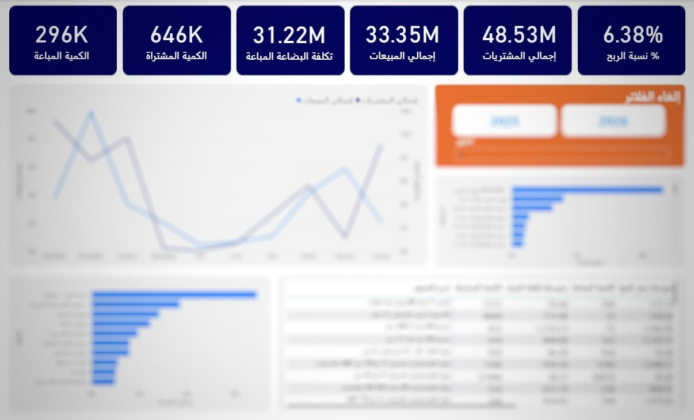

# Supply Chain & Sales Analytics Dashboard 📊

## 📌 Project Overview
This Power BI dashboard provides a comprehensive analysis of supply chain operations and sales performance for a wholesale trading business. It enables stakeholders to monitor inventory levels, procurement costs, and profitability in real-time.

> **Note:** To protect client confidentiality, all sensitive data (such as specific client names and raw transaction records) has been anonymized or replaced with representative placeholder data.

---

## 🚀 Key Features & Insights
- **Financial Performance:** Tracked a total sales volume of **33.35M** with a net profit margin of **6.38%**.
- **Supply Chain Monitoring:** Analyzed the gap between purchased quantities (646K units) and sold quantities (296K units) to optimize inventory turnover.
- **Trend Analysis:** Monthly comparison between sales and purchases to identify seasonal peaks and cash flow requirements.
- **Top Performers:** Identification of high-value clients and top-selling products based on average selling price vs. cost.

---

## 🛠️ Tech Stack & Skills
- **Power BI:** Data visualization and report authoring.
- **DAX (Data Analysis Expressions):** - Implemented **Moving Weighted Average Cost** for precise inventory valuation.
  - Created dynamic Year-over-Year (YoY) growth metrics.
- **Power Query (M):** Advanced ETL processes to clean and transform transactional data from multiple sources.
- **Data Modeling:** Designed a robust **Star Schema** to ensure high performance and scalability.

---

## 📸 Dashboard Preview
 
*(Make sure the image file name matches the one you uploaded to GitHub)*

---

## 💬 Client Testimonial
> "The dashboard provided a level of clarity we didn't have before. Being able to track the profit margin per product category in real-time has significantly improved our procurement strategy."
> — **Project Stakeholder**

